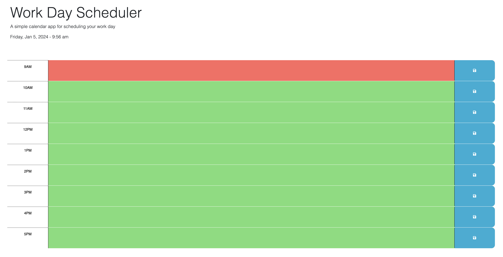

# Work Day Scheduler Starter Code

This project is the creation of a daily work calendar so that you can save the events you have going on that day. 
There is basic functionality of typing in your desired content, pressing the save button to save it, and being able to refresh it and still have the values there. 
There is a clock on the top that shows you the time and was brought in using day.js. 

# This is what the website should look like:
